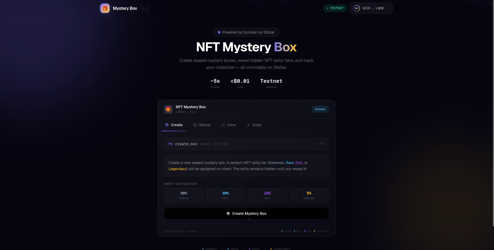

# NFT Mystery Box 🎁

<div align="center">
  

  <br />
  <br />

  <a href="https://bib-day2-nft-mystery-box.vercel.app/" target="_blank">
    
  </a>

  <br />

  <a href="https://bib-day2-nft-mystery-box.vercel.app/" target="_blank">
    <h3>🚀 Play Live Demo</h3>
  </a>

  <p><i>Empowering decentralized collectibles on the Stellar network.</i></p>
</div>

## Project Title
**NFT Mystery Box** — A Decentralized NFT Loot Box Platform on Stellar

---

## Project Description

NFT Mystery Box is a blockchain-powered dApp built on the **Stellar network** using the **Soroban smart contract** framework. The platform enables users to create sealed mystery boxes containing randomly assigned NFT rarity tiers: **Common, Rare, Epic, or Legendary**. Every box creation and reveal is recorded immutably on the Stellar blockchain, ensuring full transparency and tamper-proof fairness. By utilizing verifiable on-chain data for rarity assignment, the platform provides a trustless environment where users can verify the authenticity of their rewards. Real-time platform-wide statistics are also maintained, showing the total number of boxes created and opened, offering a live view of the ecosystem's activity. This project combines gaming excitement with blockchain's core principles of decentralization and provable fairness.

---

## Project Vision

Our vision is to revolutionize the collectible loot-box market by replacing opaque centralized algorithms with **trustless, verifiable on-chain logic**. Traditional systems often lack transparency, leaving collectors unsure of their true odds. NFT Mystery Box leverages Stellar's efficiency to provide a low-cost, decentralized alternative where rarity is provably fair. By making these mechanics accessible globaly on the Stellar network, we aim to build a transparent ecosystem for digital assets where ownership and probability are beyond manipulation. This platform creates a big impact by showcasing how blockchain can solve trust issues in gaming and collectibles.

---

## Key Features

| Feature | Description |
|---|---|
| 🎲 **Randomized Rarity Tiers** | Each mystery box is assigned a rarity tier (Common: 50%, Rare: 30%, Epic: 15%, Legendary: 5%) using on-chain pseudo-random logic at the time of creation. |
| 📦 **Create Mystery Boxes** | Users can create new sealed mystery boxes that are stored immutably on the Stellar blockchain. Each box receives a unique ID and records the owner's identity and creation timestamp. |
| 🔓 **Reveal (Open) Mystery Boxes** | Box owners can open their sealed mystery boxes to reveal the hidden NFT rarity tier. Once opened, the box is permanently marked as revealed with a recorded timestamp. |
| 📊 **Real-Time Platform Statistics** | The contract maintains live platform-wide stats — total boxes created, boxes opened, and boxes still sealed — accessible by anyone at any time. |
| 🔒 **Double-Open Protection** | The smart contract enforces a strict rule that prevents a mystery box from being opened more than once, ensuring integrity and preventing exploit attempts. |
| ⛓️ **Fully On-Chain** | All data — box details, rarity assignments, ownership, timestamps, and stats — is stored entirely on the Stellar blockchain with no off-chain dependencies. |

---

## Smart Contract Info

- All smart contract source code is located in the `contract/contracts/contract/` directory.
- **Path to smart contract**: `./contract/contracts/contract/src/lib.rs`
- **Path to test file**: `./contract/contracts/contract/src/test.rs`

### Functions Written Inside the NFT Mystery Box Smart Contract:

1. **`create_box(env: Env, owner: String) -> u64`**  
   Creates a new sealed mystery box for the specified owner. A pseudo-random NFT rarity tier (Common, Rare, Epic, or Legendary) is assigned at creation using on-chain ledger data. The box is stored on the blockchain and a unique box ID is returned.

2. **`open_box(env: Env, box_id: u64) -> MysteryBox`**  
   Opens (reveals) a sealed mystery box by its unique box ID. The hidden rarity tier is revealed, the box is marked as opened with a timestamp, and the updated box data is returned. Panics if the box does not exist or has already been opened.

3. **`view_box(env: Env, box_id: u64) -> MysteryBox`**  
   Retrieves the complete details of a mystery box by its unique box ID, including owner, rarity tier, creation time, opened status, and open time. Returns default values if the box is not found.

4. **`view_platform_stats(env: Env) -> PlatformStats`**  
   Returns the overall platform statistics including the total number of mystery boxes created, the number of opened boxes, and the number of boxes still sealed.

---

## Software Development Plan

A structured approach was followed to develop this decentralized platform:

1.  **Architecture Design**: Define the `MysteryBox` and `PlatformStats` data structures to be stored efficiently on the Stellar ledger.
2.  **Smart Contract Implementation**: Development of core functions (`create_box`, `open_box`) using Rust and the Soroban framework.
3.  **On-Chain Logic**: Implementation of the pseudo-random rarity logic using verifiable on-chain ledger data (timestamps).
4.  **Testing & Optimization**: Comprehensive unit testing in `test.rs` to ensure contract security and avoid double-revealing.
5.  **Frontend Integration**: Building a React-based application to interact with the smart contract using the Soroban JSON-RPC and Freighter wallet.
6.  **Deployment**: Final deployment of the contract to the Stellar Testnet and configuration of global platform statistics tracking.

---

## About Me

### Saurav Gupta
- **IIT Bhilai**: 3rd Year, Computer Science and Engineering.
- **Interests**: Blockchain Development, Full-Stack Applications, and Data Structures.

**Personal Story:**
I am a 3rd-year Computer Science student at IIT Bhilai, and this project marks my first deep dive into the world of blockchain. Discovering the power of decentralized systems and smart contracts on Stellar has been an incredible journey. What started as a curiosity about how 'trustless' systems work turned into building this NFT Mystery Box dApp, blending my passion for gaming mechanics with the transparency of Soroban.

---

## Installation Guide

To get the project running locally, follow these steps:

1.  **Clone the repository:**
    ```bash
    git clone https://github.com/Saurav1375/BIB-Day2-NFT-Mystery-Box.git
    cd BIB-Day2-NFT-Mystery-Box
    ```

2.  **Prerequisites:**
    - Install [Rust](https://www.rust-lang.org/tools/install)
    - Install [Soroban CLI](https://soroban.stellar.org/docs/getting-started/setup#install-the-soroban-cli)
    - Install [Node.js](https://nodejs.org/)

3.  **Build the Smart Contract:**
    ```bash
    cd contract
    soroban contract build
    ```

4.  **Run Tests:**
    ```bash
    cargo test
    ```

5.  **Deploy (Optional):**
    ```bash
    soroban contract deploy --network testnet --source-account <YOUR_ACCOUNT> --wasm target/wasm32-unknown-unknown/release/nft_mystery_box.wasm
    ```

---

## Future Scope

- 🛒 **NFT Marketplace Integration** — Allow users to buy, sell, and trade mystery boxes with other users directly on-chain through a decentralized marketplace.
- 🎨 **NFT Metadata & Artwork** — Attach rich metadata (images, descriptions, attributes) to each rarity tier using IPFS or Stellar's data entries, turning mystery boxes into true collectible NFTs.
- 🏆 **Tiered Reward System** — Introduce seasonal events, limited-edition boxes, and bonus reward tiers to drive engagement and create scarcity.
- 👥 **Multi-Owner & Gifting Support** — Enable users to transfer or gift their sealed mystery boxes to other wallet addresses before opening.
- 🔗 **Cross-Chain Compatibility** — Explore bridging mystery box NFTs to other blockchains (Ethereum, Polygon) for broader ecosystem interoperability.
- 📱 **Frontend dApp** — Build a polished React-based frontend with wallet integration (Freighter) for a seamless user experience.
- 🎮 **Gamification Layer** — Add achievements, leaderboards, and streak bonuses for users who collect and open multiple mystery boxes.
- 🔐 **Enhanced Randomness** — Integrate a more robust on-chain randomness solution (e.g., VRF oracles) for provably fair rarity distribution.

## Contract Deployment Details
- **Contract ID**: CAMRESPDOECQDKX262Q4VZPAIP4ZRVYKG4I3J3VVXJSUBSIPTMEDC7JJ
- **Contract Screenshot**: 
